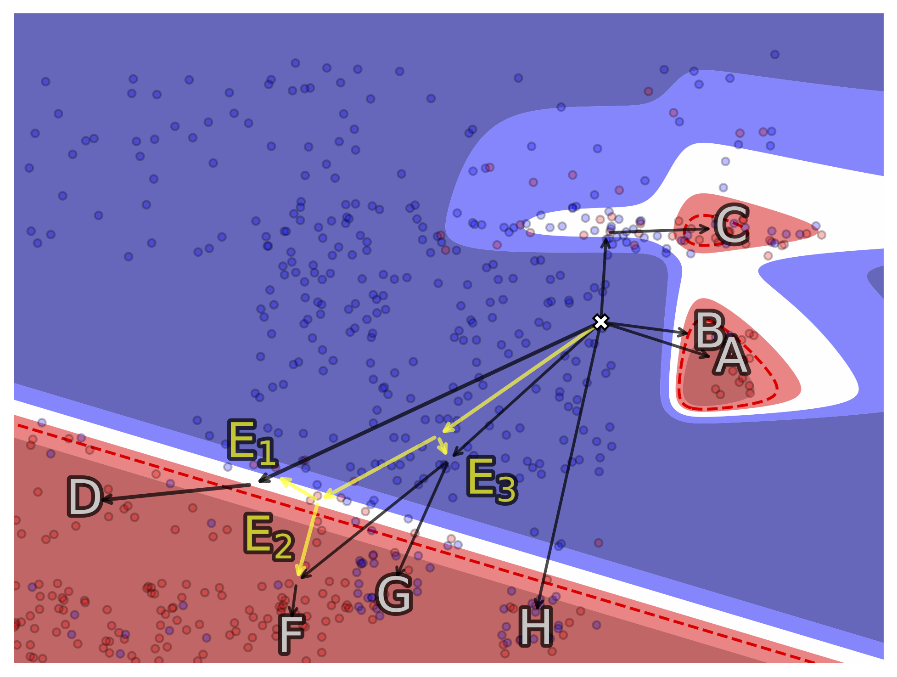

[](https://github.com/xuanxuanxuan-git/facelift/blob/main/LICENSE)
[](https://arxiv.org/abs/xxxx.xxxxx)

# FACELift 

This repository hosts `FACElift` – source code and useful resources for the following paper. 

> **Navigating Explanatory Multiverse Through Counterfactual Path Geometry**
>
> Counterfactual explanations are the de facto standard when tasked with interpreting decisions of (opaque) predictive models.
> Their generation is often subject to algorithmic and domain-specific constraints – such as density-based feasibility for the former and attribute (im)mutability or directionality of change for the latter – that aim to maximise their real-life utility.
> In addition to desiderata with respect to the counterfactual instance itself, the existence of a viable path connecting it with the factual data point, known as algorithmic recourse, has become an important technical consideration.
> While both of these requirements ensure that the steps of the journey as well as its destination are admissible, current literature neglects the multiplicity of such counterfactual paths.
> To address this shortcoming we introduce the novel concept of explanatory multiverse that encompasses all the possible counterfactual journeys and shows how to navigate, reason about and compare the geometry of these paths – their affinity, branching, divergence and possible future convergence – with two methods: vector spaces and graphs.
> Implementing this (interactive) explanatory process grants explainees more agency by allowing them to select counterfactuals based on the properties of the journey leading to them in addition to their absolute differences.

```bibtex
@article{
  title={Navigating Explanatory Multiverse Through Counterfactual Path Geometry},
  author={Sokol, Kacper and Small, Edward and Xuan, Yueqing},
  journal={arXiv preprint arXiv:xxxx.xxxxx},
  year={2023}
}
```

## Tabular Data Example

The role of geometry in (counterfactual) explainability is captured by the following figure, which demonstrates the diverse characteristics of counterfactual paths for a two-dimensional toy data set with continuous numerical features.

<p style="text-align:center">

</p>

> Example of **explanatory multiverse** constructed for tabular data with two continuous (numerical) features.
> It shows various types of **counterfactual path geometry** – their *affinity*, *branching*, *divergence* and *convergence*.
> Each journey terminates in a (possibly the same or similar) counterfactual explanation but characteristics of the steps leading there make some explanations more attractive targets, e.g., by giving the explainee more agency through multiple actionable choices towards the end of a path.

When considered in *isolation*, these paths shown in the figure above have the following properties:

- **B** is short but terminates close to a decision boundary, thus carries high uncertainty;
- **A** while longer and leading to a high-confidence region, it lacks data along its journey, which signals that it may be infeasible;
- **C** addresses the shortcomings of A, but it terminates in an area of high instability (compared to D, E<sub>i</sub>, F, G & H);
- **G & H** also do not exhibit the deficiencies of A, but they lead to an area with a high error rate;
- **D & F** have all the desired properties, but they require the most travel; and
- **E<sub>i</sub>** are feasible, but they are *incomplete* by themselves.

To compose richer explanations, we introduce the concept of *explanatory multiverse*, which allows for *spatially-aware counterfactual explainability*.
Our approach encompasses all the possible counterfactual paths and helps to navigate, reason about and compare the *geometry* of these journeys – their affinity, branching, divergence and possible future convergence.

## MNIST Example

To run the example:

- instal Python dependencies with `pip install -r requirements.txt`;
- place the dataset files in `/data/raw_data/`; and
- run `python run_explainer.py` with the default configuration.

The code to generate counterfactual explanations for the MNIST dataset is available in [`mnist_example.ipynb`](examples/mnist_example.ipynb).
The following figure demonstrates counterfactual pathfinding in the MNIST dataset and the branching factors of these paths.

<p style="text-align:center">

</p>

> Example counterfactual journeys identified in the MNIST data set of handwritten digits. Paths 1 (blue) and 2 (green) explain an instance $\mathring{x}$ classified as $\mathring{y} = 1$ for the counterfactual class $\check{y} = 9$.
> Paths leading to alternative classification outcomes are also possible (shown in grey).
> Path 1 is shorter than Path 2 at the expense of explainees' agency – which is reflected in its smaller branching factor – therefore switching to alternative paths leading to different classes is easier, i.e., less costly in terms of distance.

## Hyper-parameters

The hyper-parameters are defined in the [`params.yaml`](facelift/library/params.yaml) file.
(Command line configuration will be implemented in future releases.)

## Datasets

### MNIST

```
distance_threshold: 6.1
prediction_threshold: 0.6
penalty_term: 1.1

directed: True
distance_function: l2
method: knn
knn:
  n_neighbours: 5

start_point_idx: 1
target_class: 9
```

### HELOC

To use tabular dataset, we first need to do preprocessing:

- one-hot encoding of categorical features; and
- normalisation.
