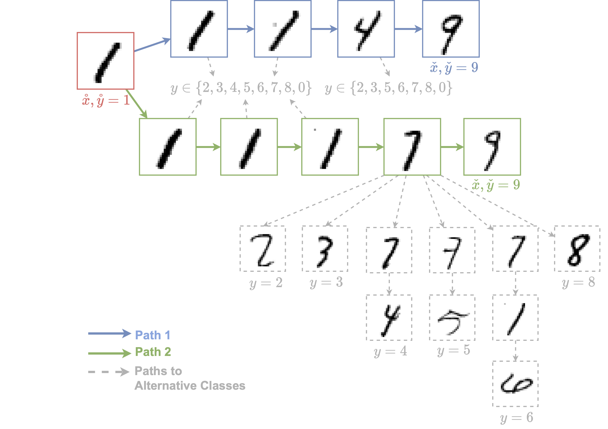

# FaceLift 

This repository contains the source code, as well as other useful information, for the paper "Navigating Explanatory Multiverse Through Counterfactual Path Geometry". 

The paper is available here: arXiv (to be added).

Please consider citing our work if you find it useful. Thank you! :D

```
@article{
  title={Navigating Explanatory Multiverse Through Counterfactual Path Geometry},
  author={Small, Edward and Xuan, Yueqing and Sokol, Kacper},
  journal={arXiv preprint arXiv:xxx}
  year={2023}
}
```

---

## Introduction
We introduce a <i>spatially-aware counterfactual explainers</i> in our proposed <i>explanatory multiverse</i> -- <b>FaceLift</b>. Our explainer encompasses all the possible counterfactual journeys, and show how to navigate, reason about and compare the <i>geometry</i> of these paths -- their affinity, branching, divergence and possible future convergence.

The role of geometry in (counterfactual) explainability is captured by the following figure, which demonstrates the diverse characteristics of counterfactual paths for a two-dimensional toy data set with continuous numerical features. 
<p style="text-align:center">

</p>
When considered in isolation, these paths have the following properties: 

- **B** is short but terminates close to a decision boundary, thus carries high uncertainty;
- **A** while longer and leading to a high-confidence region, lacks data along the journey which signals that it may be infeasible;
- **C** addresses the shortcomings of **A**, but it terminates in an area of high instability (compared to **D**, **E<sub>i</sub>**, **F**, **G** & **H)**; 
- **G** & **H** also do not exhibit the deficiencies of **A**, but lead to an area with a high error rate;
- **D** & **F** have all the desired properties but require the most travel; and
- **E<sub>i</sub>** are feasible, but incomplete by themselves.

---

## Get started
``
pip install -r requirements.txt
``

## Run the explainer
- First, put the dataset file under the ``/data/raw_data/`` folder.
- Then run the following command with default configurations.

    ``
    python run_explainer.py
    ``

## MNIST dataset illustration in the paper
- The code to generate counterfactual explanations in the MNIST dataset can be viewed in [mnist_example.ipynb](/examples/mnist_example.ipynb). 

The following figure demonstrate the counterfactual pathfinding in the MNIST dataset and the branching factors in these paths.

<p style="text-align:center">

</p>

In this figure, paths 1 (blue) and 2 (green) explain an instance $\mathring{x}$ classified as $\mathring{y} = 1$ for the counterfactual class $\check{y}$ = 9. Paths leading to alternative classification outcomes are also possible (shown in grey). Path 1 is shorter than Path 2 at the expense of explainees’ agency – which is reflected in its smaller branching factor – therefore switching to alternative paths leading to different classes is easier, i.e., less costly in terms of distance.


---

## Hyper-parameters
The hyper-parameters are defined in [params.yaml](/facelift/library/params.yaml) file. It plans to support inputs from command line. 

## Datasets
### MNIST dataset
<code>
start_point_idx=1<br>
target_class = 9<br>
distance_threshold: 6.1-7<br>
penalty_term: 1.1<br>
knn: {n_neighbours: 5/10/20}<br>
kde: n/a
</code>

### HELOC dataset
To use tabular dataset, we first need to do preprocessing
- One-hot encoding on categorical features
- Normalisation 

---
